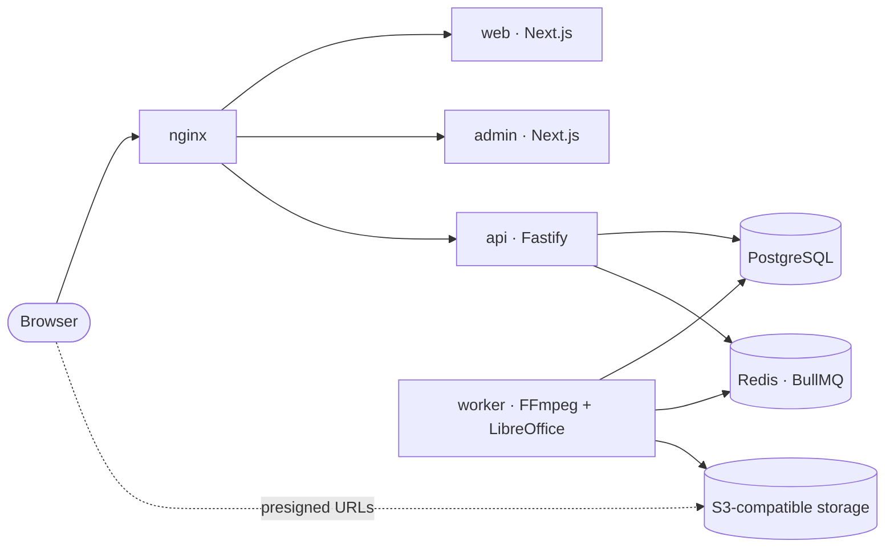

# MediaForge

MediaForge is a media-processing SaaS built as a TypeScript monorepo. Users upload video, audio,
images and office documents; a queue-driven worker converts them; results come back as short-lived,
signed download links. It is designed so the web tier, API and workers are all stateless and the only
durable state lives in PostgreSQL, Redis and S3-compatible object storage.

> **Status.** Fully runnable locally with Docker Compose. **Production: a cloud-ready architecture
> and a documented deployment path — it is not deployed anywhere**, and it needs no paid cloud
> account, domain or Kubernetes to run. See [docs/PRODUCTION.md](docs/PRODUCTION.md).

## What it does

| Tool            | Input                                                               | Result                                            |
| --------------- | ------------------------------------------------------------------- | ------------------------------------------------- |
| Convert to MP4  | MP4 / MOV video                                                     | H.264 / AAC MP4                                   |
| Compress video  | video                                                               | smaller MP4 (high / balanced / small)             |
| Resize video    | video                                                               | MP4 at a chosen width and/or height               |
| Trim video      | video                                                               | the section between a start and an end / duration |
| Extract MP3     | video with audio                                                    | MP3 (high / balanced / small)                     |
| Images → PDF    | 1–40 JPG / PNG / WebP, reorderable                                  | one PDF, one page per image, in your order        |
| Documents → PDF | DOCX, PPTX, XLSX, ODT, ODS, ODP, RTF, TXT, and legacy DOC, PPT, XLS | PDF via headless LibreOffice                      |

The dashboard shows a status-driven card per file (uploading, queued, processing, completed, failed),
with retry, cancel, delete, inline preview (video, audio, PDF) and download.

## Architecture



- **The API never processes media.** It authenticates, validates, records a job in PostgreSQL and
  enqueues a small message. A separate **worker** runs FFmpeg, `pdf-lib` or LibreOffice.
- **Bytes never pass through the API.** Uploads and downloads go straight to object storage on
  presigned URLs.
- **PostgreSQL is the source of truth.** The worker re-reads and re-validates the job; the queue
  message is only a nudge. State changes are conditional updates, so retries, duplicate deliveries
  and multiple replicas are safe.
- **Operations are additive.** A validated operation name maps to a handler through a lookup table;
  the compiler fails the build if one is missing.

Full detail, including the end-to-end job sequence: [docs/ARCHITECTURE.md](docs/ARCHITECTURE.md).

## Technology

Next.js 16 · React 19 · TypeScript 5.9 (strict) · Tailwind CSS 4 · TanStack Query · Fastify 5 · Pino ·
PostgreSQL · Prisma 7 · Redis · BullMQ · S3 (MinIO locally) · FFmpeg · LibreOffice · `pdf-lib` · Zod ·
Docker Compose · nginx · Vitest · Playwright · npm workspaces.

## Reliability and security

- **Failure handling:** permanent failures (bad input) are recorded with a fixed, safe message and are
  not retried; transient ones retry with exponential backoff; a worker killed mid-job is recovered by
  BullMQ's stalled-job detection and the idempotent pipeline resumes.
- **Auth:** short-lived access JWT plus a rotating refresh token in an `HttpOnly`, `SameSite=Strict`
  cookie (only a SHA-256 digest is stored), double-submit CSRF on refresh and logout, bcrypt
  password hashing, role-based access for the admin app.
- **Isolation:** every job route is ownership-checked, and someone else's job is indistinguishable
  from a missing one. Storage keys are always server-generated.
- **Abuse limits:** Redis-backed per-IP rate limiting with a correctly-trusted client address
  (`X-Forwarded-For` cannot be spoofed to dodge it), per-user active-job cap, type / size / count
  limits on every upload, and a stale-upload sweep that cannot race an in-flight upload.
- **Safe execution:** external tools run via `execFile` with fixed argument arrays — no shell, no
  client-supplied flags, no generic "run FFmpeg" method.
- **Operability:** JSON logs with correlation ids, real liveness/readiness endpoints for the API and
  the worker, graceful shutdown, non-root minimal images, and startup validation of all configuration.

## Run it locally

You need [Docker](https://docs.docker.com/get-docker/) with Compose v2. Nothing else.

```bash
# 1. Two different random secrets (Compose refuses to start without them).
#    bash / zsh / Git Bash:
printf 'JWT_ACCESS_SECRET=%s\nJWT_REFRESH_SECRET=%s\n' \
  "$(openssl rand -base64 48)" "$(openssl rand -base64 48)" > .env
#    PowerShell: generate two values with
#    [Convert]::ToBase64String([Security.Cryptography.RandomNumberGenerator]::GetBytes(48))
#    and put them in .env as JWT_ACCESS_SECRET=... and JWT_REFRESH_SECRET=...

# 2. Build and start everything.
docker compose up --build -d

# 3. Create the database schema (a deliberate, explicit one-shot step).
docker compose run --rm migrate
```

Then open **http://localhost** and register an account. The admin app is at
**http://localhost/admin** (it requires an account with the `ADMIN` role).

- `docker compose ps` shows every service with a real health status; `api` and `worker` are healthy
  only while PostgreSQL, Redis and storage are reachable.
- After recreating `api`, `web` or `admin`, run `docker compose restart nginx` (nginx resolves
  upstreams once at startup).
- The `.env` for Compose needs **only** the two secrets. Do not copy `.env.example` over it:
  `.env.example` describes running the apps directly on your host (`localhost` URLs) and would
  override the container-internal defaults Compose already sets.

Running the apps directly with `npm run dev` requires you to provide PostgreSQL, Redis and an
S3-compatible endpoint yourself (Compose does not publish the database or Redis ports to the host);
that path is described by `.env.example` but is not part of the tested workflow.

## Tests and quality gates

```bash
npm install
npm test            # API and web unit / integration tests (Vitest)
npm run typecheck   # strict TypeScript across every workspace
npm run lint        # ESLint, zero warnings allowed
npm run build       # Prisma client + every workspace
npm run test:e2e    # Playwright (requires a running web app)
```
The API tests drive the real Fastify route and hook pipeline against in-memory fakes. Media-processing workflows are additionally verified against the real Docker stack using FFmpeg and LibreOffice, with generated PDFs inspected structurally.

## Production

MediaForge is built to be deployed without architectural rewrites once infrastructure exists:
configuration is environment-driven and validated at startup, storage is any S3-compatible service,
migrations are an explicit release step, and API and worker scale independently. The guide covers the
target architecture, every environment variable, the migration procedure, S3/Redis/PostgreSQL setup,
health probes, scaling, backups and a deployment checklist — and an honest list of known limitations:

**[docs/PRODUCTION.md](docs/PRODUCTION.md)** · template: [`.env.production.example`](.env.production.example)

### Dependency audit note

`npm audit` reports four high-severity advisories in `deepmerge-ts` and `mysql2`, reachable only
through Prisma 7.10's optional CLI dependency tree; npm's automated fix would downgrade Prisma to 6 and
has intentionally not been forced. **No long-running image contains them**: the API, worker, web and
admin images install only their own production dependencies (`--omit=dev --omit=optional`, or a traced
Next.js standalone bundle), and the Prisma CLI exists only in the short-lived `migrate` image.
Re-run `npm audit --omit=dev` and update Prisma when a patched stable release ships.

## Repository layout

```text
apps/
  web/                  customer Next.js app
  admin/                operations Next.js app (served under /admin)
  api/                  Fastify API and the BullMQ worker entrypoint
packages/
  config/               Zod-validated environment schema
  database/             Prisma schema, migrations, generated client
  types/                cross-app transport contracts
  validation/           shared Zod schemas, incl. the operation union
  auth-client/          shared browser auth / API client
  ui/                   shared React primitives
infrastructure/
  docker/               API/worker, web and admin Dockerfiles
  nginx/                reference reverse proxy
docs/                   architecture and production guides```

Inside the API, dependencies point inward: routes call application services; services depend on
domain ports; only infrastructure adapters touch Prisma, S3, Redis, FFmpeg, LibreOffice, bcrypt or JWT.
