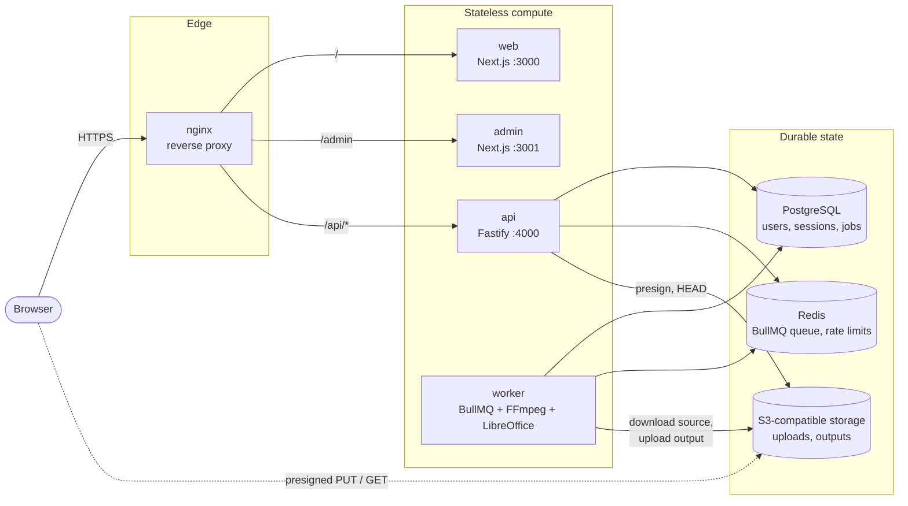

# MediaForge architecture

MediaForge is an npm-workspaces monorepo: two Next.js apps, a Fastify API, and a BullMQ worker
that runs FFmpeg and LibreOffice. All durable state lives in three stores — **PostgreSQL**,
**Redis**, and **S3-compatible object storage** — so every compute component is stateless and
replaceable. This document explains how the pieces fit; [PRODUCTION.md](PRODUCTION.md) explains how
to run them for real.

## Components



| Component | Role                                                                                                                                                                                             |
| --------- | ------------------------------------------------------------------------------------------------------------------------------------------------------------------------------------------------ |
| `web`     | Customer app: sign-in, upload, tools, job status, preview and download.                                                                                                                          |
| `admin`   | Role-protected operations app under `/admin`, isolated so it can get stricter network controls.                                                                                                  |
| `api`     | Auth, upload initiation and confirmation, job requests, status, and short-lived download URLs. **Never runs FFmpeg or LibreOffice inside a request.**                                            |
| `worker`  | The same codebase as the API with a different entrypoint. Consumes the queue, downloads inputs, runs FFmpeg / `pdf-lib` / LibreOffice, uploads the result. Also runs the stale-upload sweep.     |
| Postgres  | **Authoritative** state: users, refresh sessions, jobs, ordered job inputs, processed-file records.                                                                                              |
| Redis     | BullMQ queue and scheduler, plus the shared counters behind rate limiting. Holds nothing that cannot be reconstructed from Postgres, with one caveat (see "Known limitations" in PRODUCTION.md). |
| Storage   | Source uploads and processed outputs. Objects are private; the browser only ever holds short-lived presigned URLs.                                                                               |

## A job, end to end

```mermaid
sequenceDiagram
  autonumber
  participant B as Browser
  participant A as API
  participant S as Object storage
  participant P as PostgreSQL
  participant Q as Redis / BullMQ
  participant W as Worker

  B->>A: POST /uploads (type, size)
  A->>P: create Job (PENDING)
  A-->>B: presigned PUT URL
  B->>S: PUT bytes (direct, never through the API)
  B->>A: POST /uploads/:id/complete
  A->>S: HEAD object (exists? size matches?)
  A->>P: Job -> UPLOADED (conditional update)
  B->>A: POST /uploads/:id/process {operation, options}
  A->>P: Job -> QUEUED (conditional update, persists operation + options)
  A->>Q: enqueue {jobId, userId, attempt}
  Q->>W: deliver
  W->>P: load Job (authoritative; the queue message is not trusted)
  W->>P: Job -> PROCESSING
  W->>S: download inputs to an ephemeral temp dir
  W->>W: run the operation handler (fixed-argument FFmpeg / pdf-lib / LibreOffice)
  W->>S: upload output
  W->>P: ProcessedFile row, Job -> COMPLETED
  B->>A: GET /uploads/:id/output
  A-->>B: short-lived presigned GET URL
```

Two design points do most of the work:

- **Postgres is the source of truth; the queue message is only a nudge.** It carries
  `{ jobId, userId, attempt }` and nothing else. The worker re-reads the job, re-validates the
  stored operation and options, and ignores anything the queue claims. Every state transition is a
  conditional (compare-and-set) update, so duplicate deliveries, retries and concurrent replicas are
  idempotent.
- **Bytes never pass through the API.** Uploads go browser → storage on a presigned URL whose
  `Content-Length` is signed; downloads are presigned GETs with the disposition (inline vs
  attachment) signed in. The API only handles small JSON.

## Operations

New media tools are additive. A validated operation name maps through a lookup table
(`OPERATION_HANDLERS`) to a handler that owns only operation-specific work; the shared worker owns
storage, temp files and job state. TypeScript fails the build if an operation has no handler.

| Operation         | Input                                                    | Engine                                       |
| ----------------- | -------------------------------------------------------- | -------------------------------------------- |
| `convert-to-mp4`  | MP4 / MOV video                                          | FFmpeg                                       |
| `compress-video`  | video                                                    | FFmpeg (quality presets)                     |
| `resize-video`    | video                                                    | FFmpeg (width / height, max 7680)            |
| `extract-mp3`     | video with audio                                         | FFmpeg (quality presets)                     |
| `trim-video`      | video                                                    | FFmpeg (start + end or duration)             |
| `image-to-pdf`    | 1–40 JPG / PNG / WebP, ordered                           | `pdf-lib` (WebP transcoded to PNG by FFmpeg) |
| `document-to-pdf` | DOCX, PPTX, XLSX, ODT, ODS, ODP, RTF, TXT, DOC, PPT, XLS | headless LibreOffice, worker image only      |

Security constraints on execution: `execFile` with a fixed argument array (never a shell), no
client-supplied flags, no generic "run FFmpeg with these args" method, safe fixed error messages
instead of raw tool output, and one isolated temp directory per job that is always removed.

## API layering

```text
presentation/routes  →  application/*  (services)  →  domain/*  (repository & storage ports)
                                                            ↑
                                              infrastructure/*  (Prisma, S3, BullMQ, FFmpeg,
                                                                 LibreOffice, bcrypt, JWT)
```

Routes call services; services depend on ports; only infrastructure adapters touch Prisma, S3,
Redis or the child-process tools. This is what lets the tests run the real Fastify route pipeline
against in-memory fakes.

## Reliability model

| Failure                        | Behaviour                                                                                                                                                              |
| ------------------------------ | ---------------------------------------------------------------------------------------------------------------------------------------------------------------------- |
| Bad input (corrupt file, etc.) | **Permanent**: job marked `FAILED` with a fixed safe message; no retry.                                                                                                |
| Storage / network / DB blip    | **Transient**: BullMQ retries (3 attempts, exponential backoff from 5 s); `FAILED` only when attempts are exhausted.                                                   |
| Worker dies mid-job            | Job stays `PROCESSING`; BullMQ's stalled-job detection redelivers it and the idempotent pipeline resumes.                                                              |
| Same request twice             | Deterministic BullMQ job id per `(jobId, attempt)` and conditional state updates make submission idempotent.                                                           |
| User retries a failed job      | `FAILED → QUEUED` with a new attempt number, hence a new queue id.                                                                                                     |
| Abandoned uploads              | A repeatable sweep cancels stale `PENDING` uploads only after the presigned URL's TTL **plus a grace period** has passed, so it can never race a late in-flight `PUT`. |
| One user floods the queue      | Per-user active-job limit (default 3) — a fairness throttle, not a security boundary.                                                                                  |

## Security model

- **Auth:** short-lived HS256 access JWT (bearer); refresh JWT in an `HttpOnly`, `SameSite=Strict`
  cookie, stored server-side only as a SHA-256 digest, **rotated on every refresh** and revocable.
  Refresh and logout require a double-submit CSRF token.
- **Authorization:** every job/file route is authenticated and ownership-checked; a foreign or
  missing object both return `404` so IDs cannot be enumerated. Admin routes additionally require
  the `ADMIN` role.
- **Rate limiting:** Redis-backed, per client IP (global 100/min; register 5, login 10, upload and
  process routes 10–30). The client IP comes only from the proxies we operate
  (`TRUST_PROXY_HOPS`), never from a client-supplied `X-Forwarded-For`.
- **Uploads:** type allow-list and size caps checked at initiation, `Content-Length` signed into the
  presigned URL, and the object's existence and size verified server-side before a job may proceed.
- **Object keys are server-generated** (`uploads/<userId>/<uuid>`); no client-supplied key is ever
  accepted.
- **Hardening:** Helmet, an origin-allow-listed CORS policy, a 1 MiB JSON body limit, Zod validation
  on every input, centralized safe errors, and log redaction of `Authorization` and cookie headers.

## Repository layout

```text
apps/web        customer Next.js app
apps/admin      operations Next.js app (basePath /admin)
apps/api        Fastify API and the BullMQ worker entrypoint
packages/config       Zod-validated environment schema (fails fast at startup)
packages/database     Prisma schema, migrations, generated client
packages/types        cross-app transport contracts
packages/validation   shared Zod schemas, including the operation union
packages/auth-client  shared browser auth / API client
packages/ui           shared React primitives
infrastructure/       Dockerfiles and the nginx reference edge
docs/                 this documentation
