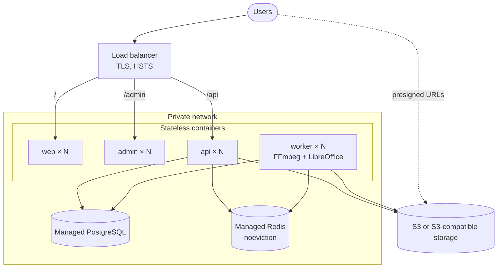

# Running MediaForge in production

> **Status: cloud-ready, not deployed.** MediaForge runs completely on a laptop with Docker Compose.
> This guide describes how it is meant to run on real infrastructure and which repository
> features make that possible without architectural changes. Nothing here has been deployed to a
> cloud account; where a statement is a recommendation rather than something verified in this
> repository, it says so.

Read [ARCHITECTURE.md](ARCHITECTURE.md) first for how the components fit together.

## Local versus production

The same images and the same code run in both; only configuration differs.

|                         | Local (Docker Compose)                    | Production                                                    |
| ----------------------- | ----------------------------------------- | ------------------------------------------------------------- |
| Edge / TLS              | `nginx` on port 80, plain HTTP            | Managed load balancer terminating TLS (or nginx + certs)      |
| API, worker, web, admin | one container each                        | N replicas each, behind the balancer / service mesh           |
| PostgreSQL              | `postgres:17-alpine` container            | Managed PostgreSQL (`DATABASE_URL`)                           |
| Redis                   | `redis:8-alpine` container                | Managed Redis (`REDIS_URL`, `rediss://`)                      |
| Object storage          | MinIO container                           | AWS S3 or any S3-compatible service (`S3_*`)                  |
| Migrations              | `docker compose run --rm migrate`         | The same `migrate` image as a one-shot release job            |
| Secrets                 | throwaway values in your shell / `.env`   | A secret manager, injected as environment variables           |
| Cookies                 | `COOKIE_SECURE=false` (HTTP on localhost) | `COOKIE_SECURE=true` (the default when `NODE_ENV=production`) |

The bundled `docker-compose.yml` is the local and reference stack. It deliberately uses
`NODE_ENV=production` over plain HTTP with well-known development credentials — do not deploy it as
is; use the environment reference and the deployment checklist below.

## Target architecture



Only the load balancer is public. Postgres and Redis stay on the private network. The storage
endpoint must be reachable from browsers, because uploads and downloads go straight to it on
presigned URLs.

## Environment variables

Validated once at startup by `packages/config`; an invalid configuration fails the process
immediately with the offending variable **names** (never values). `.env.production.example` is a
copy-paste template; `.env.example` is for running on the host during development. **Never commit
real values.** Secrets are marked **S**.

### Required

| Variable                                        | Used by              | Notes                                                                                                       |
| ----------------------------------------------- | -------------------- | ----------------------------------------------------------------------------------------------------------- |
| `NODE_ENV`                                      | all                  | `production`. Enables the production-only checks below.                                                     |
| `WEB_ORIGIN`, `ADMIN_ORIGIN`                    | api, worker          | Exact browser origins (CORS, bucket CORS). **Required when `NODE_ENV=production`** — no localhost fallback. |
| `DATABASE_URL` **S**                            | api, worker, migrate | Add `sslmode=require` (or stricter) for a managed service.                                                  |
| `REDIS_URL` **S**                               | api, worker          | `rediss://` for TLS.                                                                                        |
| `JWT_ACCESS_SECRET`, `JWT_REFRESH_SECRET` **S** | api, worker          | Two independent random values, ≥ 32 chars. **Startup fails if they are equal.**                             |
| `S3_ENDPOINT`                                   | api, worker          | Server-side endpoint of the storage service.                                                                |
| `S3_REGION`, `S3_BUCKET`                        | api, worker          |                                                                                                             |
| `S3_ACCESS_KEY`, `S3_SECRET_KEY` **S**          | api, worker          | Scoped credentials (see [Object storage](#object-storage)).                                                 |

### Common tuning

| Variable                                     | Default                     | Notes                                                                                                                                 |
| -------------------------------------------- | --------------------------- | ------------------------------------------------------------------------------------------------------------------------------------- |
| `TRUST_PROXY_HOPS`                           | `0`                         | Reverse proxies in front of the API. **Set it correctly** — see [Proxy trust](#proxy-trust-and-rate-limiting).                        |
| `COOKIE_SECURE`                              | `NODE_ENV === 'production'` | `true` on HTTPS. Set `false` only for plain-HTTP local use.                                                                           |
| `COOKIE_DOMAIN`                              | unset                       | Host-only cookie when unset.                                                                                                          |
| `S3_PUBLIC_ENDPOINT`                         | `S3_ENDPOINT`               | Only when browsers must use a different address than the server (the local Compose case).                                             |
| `S3_MANAGE_BUCKET_CORS`                      | `true`                      | `false` when bucket CORS is provisioned outside the app (recommended in production).                                                  |
| `ACCESS_TOKEN_TTL`, `REFRESH_TOKEN_TTL_DAYS` | `15m`, `30`                 |                                                                                                                                       |
| `MAX_UPLOAD_SIZE_BYTES`                      | 500 MiB                     | Applies to video/audio. Documents are capped at 25 MiB and image sets at 40 files / 25 MiB each / 200 MiB total (compiled-in limits). |
| `UPLOAD_URL_TTL_SECONDS`                     | `900`                       | Presigned-upload lifetime; also the basis for stale-upload cleanup.                                                                   |
| `PENDING_UPLOAD_GRACE_SECONDS`               | `300`                       | Extra buffer before an abandoned upload may be cleaned (a `PUT` that started just before expiry can still land).                      |
| `MAX_ACTIVE_JOBS_PER_USER`                   | `3`                         | Per-user queued + processing cap. Enforced by the API.                                                                                |
| `WORKER_CONCURRENCY`                         | `2`                         | Jobs per worker process. Worker only.                                                                                                 |
| `WORKER_HEALTH_PORT`                         | `4001`                      | Private worker health endpoint; `0` disables it. Never publish it.                                                                    |
| `FFMPEG_PATH`, `LIBREOFFICE_PATH`            | `ffmpeg`, `soffice`         | Worker only; the API image contains neither LibreOffice nor a need for it.                                                            |
| `LOG_LEVEL`                                  | `info`                      | `fatal`…`trace`.                                                                                                                      |
| `API_HOST`, `API_PORT`                       | `0.0.0.0`, `4000`           |                                                                                                                                       |

`NEXT_PUBLIC_API_URL` and `NEXT_PUBLIC_ADMIN_URL` are **build-time** arguments of the web image (they
are inlined into the browser bundle) — rebuild the image to change them. They default to the
same-origin paths `/api/v1` and `/admin`, which need no per-environment change behind one domain.

### Startup validation

Rejected at startup: malformed values, identical JWT secrets, and (in production) a missing
`WEB_ORIGIN` / `ADMIN_ORIGIN`. Nothing else is second-guessed: the bundled Compose stack
legitimately runs `NODE_ENV=production` over plain HTTP with development credentials, so the
[deployment checklist](#deployment-checklist) below, not a startup check, is what covers secure
cookies, HTTPS, real credentials and `TRUST_PROXY_HOPS`.

## Database (PostgreSQL)

- **Intended for a managed PostgreSQL** reachable over TLS (the local stack runs 17; other versions have not been tested here). Prisma
  7 talks to it through the `pg` driver adapter, so `DATABASE_URL` is a plain connection string.
- **Connection budget:** each API and worker replica holds its own `pg` pool (default up to 10
  connections). Keep `replicas × pool size` below the server's `max_connections`, or place a
  pooler in front.
- **Migrations are an explicit, one-shot release step. They never run automatically.** API and
  worker start against whatever schema exists; there is no Prisma CLI in their images.

### Migration procedure

1. **Back up** — take a snapshot / verify point-in-time recovery.
2. Build the images from the release commit.
3. Run the migration job **exactly once**:
   ```bash
   docker compose run --rm migrate          # local / reference
   # elsewhere: run the `migrate` image target once with DATABASE_URL set
   ```
   It executes `prisma migrate deploy`, which applies only committed, ordered migrations from
   `packages/database/prisma/migrations`.
4. Roll out `api` and `worker` (all migrations so far are additive, so old and new code overlap
   safely during a rolling deploy).
5. Confirm `/health/ready` is green on the new replicas.

**Never** use `prisma db push`, `prisma migrate dev`, or `prisma migrate reset` against a shared or
production database. `migrate deploy` is forward-only: recover from a bad migration by restoring the
snapshot or shipping a corrective forward migration.

## Redis

- Used for the BullMQ queue and scheduler, and as the shared store for rate-limit counters. No
  request depends on process-local state.
- **Requirements for a managed Redis:** `maxmemory-policy noeviction` (an evicting policy can silently
  discard queue data), a standalone or primary/replica topology (Redis Cluster needs BullMQ hash-tag
  prefixes and is not configured here), persistence enabled (the local stack runs with AOF), and TLS
  via `rediss://`.
- The API opens two connections (a fail-fast one for rate limiting, a dedicated one for BullMQ, which
  requires `maxRetriesPerRequest: null`); the worker opens one. Size the Redis connection limit
  accordingly.
- Retries (3 attempts, exponential backoff from 5 s) and stalled-job crash recovery are properties of
  the queue configuration, not of any one process.

## Object storage

MinIO is the local stand-in for any S3-compatible service; the code speaks only the S3 API.

| Setting                 | MinIO (local Compose)                                | AWS S3 / other S3-compatible                                           |
| ----------------------- | ---------------------------------------------------- | ---------------------------------------------------------------------- |
| `S3_ENDPOINT`           | `http://object-storage:9000` (Docker-internal)       | `https://s3.<region>.amazonaws.com` (or provider URL)                  |
| `S3_PUBLIC_ENDPOINT`    | `http://localhost:9000` (what the browser can reach) | unset — one HTTPS endpoint serves both                                 |
| `S3_REGION`             | `us-east-1`                                          | the bucket's region                                                    |
| `S3_MANAGE_BUCKET_CORS` | `false` (MinIO's own `MINIO_API_CORS_ALLOW_ORIGIN`)  | `false` and provision CORS yourself, or `true` to let the API apply it |
| Bucket creation         | lazy, on first use                                   | **pre-create it**; keep it private                                     |

Why two endpoints exist: a presigned URL's host is part of its signature, so a URL signed against a
Docker-internal hostname cannot simply be rewritten for the browser. The API therefore signs with a
separate client for the public endpoint. When both are the same (the normal cloud case) a single
client is used.

- **Bucket CORS** must allow the browser's direct upload. If you manage it yourself, allow the origins
  `WEB_ORIGIN`/`ADMIN_ORIGIN`, method `PUT`, header `content-type`. Downloads are presigned `GET`
  navigations and need no CORS rule.
- **Credentials** should be scoped to the one bucket: `s3:GetObject`, `s3:PutObject`,
  `s3:DeleteObject` on `bucket/*`, and `s3:ListBucket` on the bucket (the readiness probe uses
  `HeadBucket`). Add `s3:PutBucketCORS` only if `S3_MANAGE_BUCKET_CORS=true`, and `s3:CreateBucket` only
  if you rely on lazy creation.
- Objects are private; the API never sets a public ACL. Path-style addressing is always used (required
  by MinIO and accepted by AWS regional endpoints and most S3-compatible services).
- Suggested (not configured here): a lifecycle rule to abort incomplete multipart uploads, and either
  a retention rule or a future retention job for `processed/` outputs — see
  [Known limitations](#known-limitations).

## API and worker separation

| Property     | API                            | Worker                                                          |
| ------------ | ------------------------------ | --------------------------------------------------------------- |
| Entrypoint   | `node apps/api/dist/server.js` | `node apps/api/dist/worker.js`                                  |
| Image target | `runtime` (FFmpeg only)        | `runtime-worker` (FFmpeg **and** headless LibreOffice, ~2.0 GB) |
| Listens on   | `:4000`                        | `:4001` (health only, private)                                  |
| Holds state  | none                           | none — temp files are per-job and always deleted                |
| Scale by     | request load                   | queue depth and CPU                                             |

Both are stateless: everything durable is in Postgres, Redis or object storage, so any number of
replicas of either can run, and any replica can be replaced at any time. Conditional state
transitions and deterministic queue ids keep concurrent replicas correct. The stale-upload sweep is
registered under a fixed scheduler id, so every worker replica registers the same single schedule.

## Health and readiness

| Endpoint                   | Question it answers                                                | Touches dependencies?              | Public via nginx? |
| -------------------------- | ------------------------------------------------------------------ | ---------------------------------- | ----------------- |
| API `GET /health`          | Alias of `/health/live` (kept for compatibility)                   | no                                 | yes               |
| API `GET /health/live`     | Is the process alive?                                              | no                                 | no                |
| API `GET /health/ready`    | Can it serve requests? PostgreSQL, Redis, storage                  | yes, each bounded by a 2 s timeout | no                |
| Worker `GET /health/live`  | Is the process alive?                                              | no                                 | no (private port) |
| Worker `GET /health/ready` | Can it take jobs? PostgreSQL, Redis, both BullMQ consumers running | yes                                | no (private port) |

`/health/ready` returns `200` or `503` with per-dependency `ok`/`failed` and **no error text** (the
detail goes to the server log). The endpoints are exempt from rate limiting so frequent probes can
never look like an outage. The worker's health server is auxiliary: if it cannot bind its port (for
example `EADDRINUSE` when several worker processes share a host), that is logged and the worker keeps
processing jobs; probes against the port then fail, which is the correct signal. Set
`WORKER_HEALTH_PORT` to a free port per process, or `0` to disable it.

Use **liveness** for restarts (it ignores dependencies, so a database outage cannot restart-loop
healthy processes) and **readiness** for traffic decisions. In Compose the `healthcheck` of `api` and
`worker` is readiness. On any orchestrator, probe the API on `:4000` and the worker on `:4001`.

## Proxy trust and rate limiting

Rate limits are per client IP, derived from `X-Forwarded-For`. A client can send that header
itself, and a proxy only _appends_ to it — so trusting the whole header lets an attacker rotate it to
dodge the login and registration limits. The API therefore trusts **only the entries added by the
proxies you operate**:

| Topology                          | `TRUST_PROXY_HOPS` |
| --------------------------------- | ------------------ |
| Browser talks to the API directly | `0`                |
| nginx (the bundled edge) → API    | `1`                |
| Load balancer → nginx → API       | `2`                |
| Load balancer → API (no nginx)    | `1`                |

Too low makes every user share the proxy's address (one rate-limit bucket); too high trusts
client-supplied entries. The default is `0`, the safe failure mode. This is covered by regression
tests that drive the real rate limiter with rotating spoofed headers.

## TLS and edge headers

The bundled `infrastructure/nginx/nginx.conf` is the local/reference edge and speaks plain HTTP.
In production terminate TLS at a managed load balancer, or add a `listen 443 ssl` block with
certificates, and send `Strict-Transport-Security` **there** (HSTS must only be sent over HTTPS).
The nginx config already sets `X-Content-Type-Options`, `X-Frame-Options: SAMEORIGIN`,
`Referrer-Policy` and `Permissions-Policy`, hides its version, applies a 20 req/s limit with a burst
of 40 on `/api/`, and forwards a request id. A Content-Security-Policy is not set; see limitations.

## Logging and observability

- **Format:** the API and the worker both emit one JSON object per line (Pino) to stdout/stderr —
  ingest with any log pipeline. The worker's log lines carry `jobId`, `userId`, `attempt` and `err`
  as fields, not as message text.
- **Correlation:** for `/api/` requests nginx generates `X-Request-Id` (overwriting any client-supplied
  value); the API adopts it as the request id, includes it in
  every error body, and echoes it in the `x-request-id` response header. Quote it to find a request
  across nginx, API and logs.
- **Redaction:** `Authorization` and cookie headers are redacted from API logs.

Not built in, by design (no paid monitoring services): error tracking and metrics. The natural seams
are the API's central error handler (`src/middleware/error-handler.ts`) and the worker's
`failed` event handlers for **Sentry** or similar; a `/metrics` route on the API and on the worker's
health server for **Prometheus** (queue depth from BullMQ's `getJobCounts`, job durations); and
OpenTelemetry auto-instrumentation via `NODE_OPTIONS`.

## Graceful shutdown

Both processes handle `SIGTERM` and `SIGINT`. The API stops accepting connections and drains
in-flight requests, bounded at 25 s so a wedged close cannot hang a deploy. The worker stops taking
jobs and waits for its in-flight jobs to finish before closing; it has **no timer of its own**, so how
long a deploy waits for a running job is the orchestrator's stop timeout to decide. A worker killed
while a long job is still running is safe:
the job stays `PROCESSING`, BullMQ's stalled-job detection redelivers it, and the idempotent pipeline
resumes — verified by hard-killing (`SIGKILL`) a worker mid-job and restarting it: the job was
redelivered about 50 seconds later, completed once, and produced exactly one output. Set the
orchestrator's stop timeout at least as long as your typical media job if you want deploys to avoid
interrupting work rather than recovering from it. Job temp directories are per-attempt and removed in
a `finally`, which cannot run after a `SIGKILL`; a replaced container starts with a clean filesystem,
whereas restarting the _same_ container in place leaves the interrupted attempt's directory in `/tmp`
until it is replaced. The Next.js images run `node` directly as PID 1, so signals reach the process
(measured: about a second to stop).

## Docker images

| Image                       | Contents                                                           | Approx. size |
| --------------------------- | ------------------------------------------------------------------ | ------------ |
| `api` (`runtime`)           | Bundled API + FFmpeg + only the API's production dependencies      | ~650 MB      |
| `worker` (`runtime-worker`) | Everything in `api` + headless LibreOffice (Writer, Calc, Impress) | ~2.0 GB      |
| `web`, `admin`              | Next.js **standalone** server (traced files only), `node` as PID 1 | ~330 MB each |
| `migrate`                   | Full toolchain with the Prisma CLI; one-shot, never long-running   | ~2.5 GB      |

All long-running images run as the unprivileged `node` user, contain no dev dependencies and **no
Prisma CLI** (which carries the `mysql2` / `deepmerge-ts` advisories noted in the README; they exist
only in the short-lived `migrate` image). LibreOffice is installed in the worker image only.

The API/worker image is built with `npm ci -w @media/api`, so the frontends' dependencies are not
shipped to it; dependency layers are cached until a manifest changes. A default Docker build target is
the **last** stage in a Dockerfile, which is why `docker-compose.yml` sets `target:` explicitly on
`api`.

## Backups and disaster recovery

These are recommendations; nothing here is automated by the repository.

- **PostgreSQL is the only store you cannot afford to lose** (users, sessions, job history and the
  record of every output). Use the provider's automated backups with point-in-time recovery, and
  rehearse a restore.
- **Object storage** holds the media itself. Enable versioning if you need protection from accidental
  deletion, and cross-region replication if you need regional resilience. Users can permanently delete
  only their own failed/cancelled files; there is no API to bulk-delete outputs.
- **Redis** carries in-flight work. With persistence and a highly-available managed service, a
  failover is invisible. If Redis is lost entirely, jobs that were queued or running exist only in
  Postgres — see the first item under [Known limitations](#known-limitations).
- Keep secrets in a secret manager, not in images, `.env` files or version control. Rotating
  `JWT_REFRESH_SECRET` signs everyone out; rotating `JWT_ACCESS_SECRET` invalidates access tokens
  (clients silently re-authenticate through their refresh cookie).

## Scaling strategy

1. **API:** add replicas; it is stateless and CPU-light because it never processes media.
2. **Worker:** add replicas as queue depth grows (BullMQ exposes the waiting count in Redis), and raise
   `WORKER_CONCURRENCY` only in step with the container's CPU allocation — FFmpeg encoding is
   CPU-bound. Per-user active-job limits stop one account from monopolising the pool.
3. **Storage and CDN:** downloads already bypass the API; putting a CDN in front of the storage
   endpoint is a configuration change, not a code change.
4. **Postgres:** vertical first, then read replicas or a pooler; watch the connection budget above.
5. **Heavier document workloads:** the single worker image carries both FFmpeg and LibreOffice. If
   document conversion needs isolating, splitting it into a separate queue and worker pool is the
   next step; nothing in the current design prevents it.

## Deployment checklist

Before the first deployment:

- [ ] Managed PostgreSQL (TLS on), Redis (`noeviction`, persistence, TLS) and a private S3 bucket exist.
- [ ] Storage credentials are scoped to the bucket; bucket CORS allows `PUT` from the app origins.
- [ ] Every required variable is set from a secret manager; the two JWT secrets are independent.
- [ ] `WEB_ORIGIN` / `ADMIN_ORIGIN` are the real HTTPS origins; `COOKIE_SECURE` is `true`.
- [ ] `TRUST_PROXY_HOPS` matches the topology above.
- [ ] TLS terminates in front of the stack and HSTS is enabled there.
- [ ] Only the load balancer is public; Postgres, Redis, the API port and the worker health port are not.
- [ ] Database backups and point-in-time recovery are on, and a restore has been rehearsed.

Every release:

- [ ] Build images from the release commit; run `npm test`, `npm run typecheck`, `npm run lint`.
- [ ] Take a database snapshot.
- [ ] Run the `migrate` job once and confirm it succeeded.
- [ ] Roll out `api` and `worker`, then `web` and `admin`.
- [ ] Watch `/health/ready` and the logs for `Readiness check failed` and `fatal` entries.
- [ ] Smoke-test: sign in, upload, run one media job and one PDF conversion, download the result.

## Known limitations

Stated plainly so nobody discovers them in production.

- **No re-enqueue sweep.** The reconciliation worker only handles stale `PENDING` uploads. A job that
  Postgres records as `QUEUED` or `PROCESSING` but whose Redis entry has been lost (a Redis flush, or
  data loss beyond what persistence recovers) is not re-queued automatically and needs operator
  intervention. Managed, persistent, highly-available Redis makes this unlikely; it is not impossible.
- **No output retention.** Processed outputs and uploaded sources are kept until the user deletes a
  failed/cancelled file; `ProcessedFile.checksum` and `expiresAt` are never written. Use storage
  lifecycle rules or add a retention job before storing at scale.
- **Access tokens are not individually revocable** before they expire (15 minutes by default);
  logout and refresh rotation revoke the refresh session.
- **The declared upload type is not sniffed.** Presigned `PUT` cannot pin `Content-Type`; content is
  validated when FFmpeg, `pdf-lib` or LibreOffice actually opens it, and failures are safe and fixed
  messages. There is no malware scanning.
- **No Content-Security-Policy** on the Next.js apps, and no CSRF token on `login`/`register` (they
  carry no session yet). Refresh and logout are CSRF-protected.
- **LibreOffice is permissive:** garbage bytes named `.docx` may still yield a low-quality PDF rather
  than a clean failure; only structurally broken files reliably fail.
- **nginx resolves upstream hostnames at startup**, so after recreating `api`, `web` or `admin` under
  Compose, run `docker compose restart nginx`. A platform load balancer with service discovery does
  not have this constraint.
- **Path-style S3 addressing is fixed** (`forcePathStyle: true`). A provider that only supports
  virtual-hosted-style addressing would need a small code change.
- **No CI pipeline** is included, and email verification, password reset and billing are not
  implemented (their tables exist in the schema but are unused).
